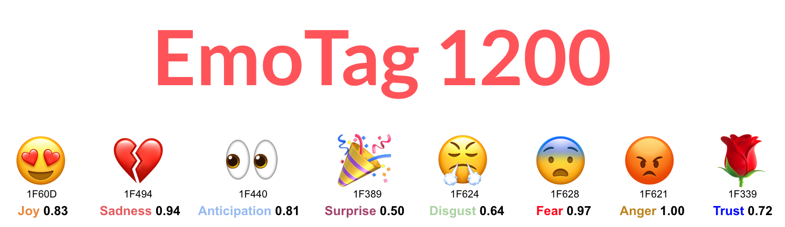

# EmoTag 👍 😄 
An emoji-centric NLP resources based on Twitter Data

## About

EmoTag is a collection of resources for analyzing emotion and sentiment of Emojis as well as Tweets written in English. The name EmoTag indicates its usefulness in exploiting emojis for emotional tagging.  

## EmoTag Resources
* **Baseline Emoji Emotion Scores**: 1200 Emoji-Emotion pairs annotated by humans. It contains emotion scores ranging from 0 to 1 for 150 most popular Twitter emojis for 8 emotion classes (i.e. anger, anticipation, disgust, fear, joy, sadness, surprise, and trust). [[Download Scores](data/EmoTag1200-scores.csv)] [[Download Details](data/EmoTag1200-scores-details.csv)]  

* **Interpretable Word Vectors**: A 620-dimensional vector representation of words trained on 20.8 million emoji-centric Twitter data. This can be used as other word vectors i.e. Word2Vec. [[Download]()]

* **Raw Tweets**: This contains a subset of tweets that we used in our experiments. Please contact us for the entire dataset. [[Download](data/EmoTag-raw-data-1f639.csv)]  

* **Word-Emoji Co-occurrence Frequencies**: This lexicon provides word-emoji co-occurrence frequencies observed in our dataset. [[Download](data/word-emoji-cooccur.zip)] 

* **Emoji-Emoji Co-occurrence Frequencies**: This is the subset of the previous lexicon (i.e. Word-Emoji co-occurrences) which contains only emoji-emoji co-occurrence counts observed in our dataset. This would be useful if someone quickly wants to find co-occurring emojis. [[Download](/data/emoji-emoji-cooccur.zip)] 

## Relevant Papers and Citation
Please cite the following paper if using any of our resources in an academic publication:

 * [EmoTag1200 👍 : Understanding the Association between Emojis 😄 and Emotions 😻](https://www.aclweb.org/anthology/2020.emnlp-main.720/). Abu Awal Md Shoeb, and Gerard de Melo, EMNLP 2020, November 2020. [[BibTeX](bibtex/Shoeb-EmoTag1200.bib)][[Slide](presentation/Abu-Shoeb-EmoTag1200-EMNLP-2020-Main-Conference-3532.pdf)][[Video](https://slideslive.com/38939357/emotag1200-understanding-the-association-between-emojis-and-emotions)]
 * [EmoTag – Towards an Emotion-Based Analysis of Emojis](https://www.aclweb.org/anthology/R19-1126/). Abu Awal Md Shoeb, Shahab Raji, Gerard de Melo. RANLP 2019, September 2019. [[BibTex](bibtex/Shoeb-EmoTag.bib)][[Slide](presentation/Abu-Shoeb-EmoTag-RANLP-2019.pdf)]

## Contact
* Email: abu.shoeb@rutgers.edu
